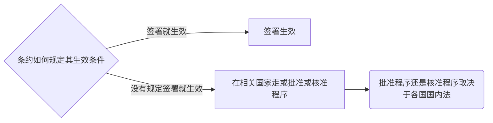
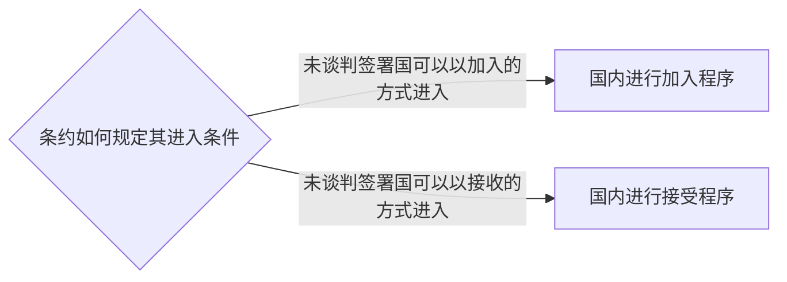

# 国际法的渊源

## 国际条约

- 国际条约原则上只约束缔约国，国际习惯一旦形成对国际法主体具有约束力
- **国际条约在中国的适用实践**
    - 宪法无规定
    - 所有**民商事**条约*(WTO条约不属于民商事条约)*可以在中国**直接**适用并**优先**适用，**但知识产权条约应当转化的除外** *（只能用转化以后的中国国内法）*
    - 知识产权条约和WTO条约转化适用*（条约转化为国内法，判决书引用国内法）*
    - 外交关系条约和领事关系条约与中国国内法并行适用*（判决中同时出现条约和国内法）*

## 国际习惯*（不包括判例）*

- 物质要素/客观要素：在实践中形成的行为模式

- 心理要素/主观要素：上述行为模式被各国认为具有法律拘束力

- 多半是不成文的

- **国际习惯的证据：官方的文书和实践*（均来源于国家）***
- **国家间的**文书和外交实践
  - **国际组织机构的**决议判决等文件
  
- **国家的**国内立法、司法、行政实践和有关文件

## 一般法律原则

- 国际法基本原则：被各国公认的、具有普遍意义的、适用国际法一切效力范围的国际法原则，在性质上属一般法律原则

- 国家主权平等原则

- 不干涉内政原则

   内政：国内管辖的事项，**且不违反国际法规则和原则**，与发生在国内国外无关

- 不使用武力、武力威胁原则

   凡是使用符合联合国宪章和国际法规则武力使用是被允许的，包括**国家对侵略行为的自卫行动**和**联合国集体安全制度下的武力使用** *（且都属于**和平手段**）*

   和平不等于非武力

- 和平解决国际争端原则

- 民族自决原则

   适用于所有民族，但服从于国家主权完整，**独立权**的部分只严格适用于**殖民统治下的民族**

- 善意履行国际义务原则

---

# 国际法律主体

## 主权国家

### 构成要素

- 定居的居民
- 确定的领土
- 政府
- 主权

### 权利

- 独立权
- 平等权
- 自保权
- 管辖权

### 国家主权豁免

- **（当下制度）**国家主权**绝对**豁免：国家的行为及其财产不受或免受他国**国内法院**的管辖，除非国家放弃对自己的管辖豁免*（**自愿**、**特定**案件、**明确**表示）*

    默示放弃包括国家的应诉行为

    放弃管辖豁免不等于放弃执行豁免，国家可以不主动履行判决*（国家的财产不得被查封、冻结、扣押）*
    
 - 国家主权限制（相对）豁免：把国家行为分为自上而下管理行为和国家以私法主体身份与他国私法主体产生商业交往的商业行为，商业行为没有管辖豁免权，但有执行豁免权

### 承认制度

- 既存国家对于新国家、新政府或其他事态的出现，以一定的方式表示接受或同意愿意与其发展正常关系的政治法律行为
- 如果被承认者经历了领土的合并分离分立独立等，则为承认新国家，否则为承认新政府
- 宪政体系内的政权更迭不需要承认
- 特征

    1. 承认的主体包括国家和政府间国际组织

    2. 一国在其宪政体系范围内正常的政权更迭不需要承认

    3. 承认是一种单方行为
- **法律的承认方式**
    - 明示承认
    - 默示承认
        - 建立外交关系*（互设使馆）*
        - 正式接收领事
        - 签订**政治性**条约
        - 投票支持其加入仅对国家开放的组织
    - 后果
        - 对新国家的承认原则上无法逆转
        - 对新政府的承认意味着对就政府政府承认的撤销

### 继承制度

- 条约继承
    - 协议优先
    - 没有协议，如果条约内容是与领土界限有关的，必须继承
    - 其他条约没有继承义务

- 财产继承和档案继承

    - 没有协议，财产不动产随领土一并继承
    - 动产和档案适用领土实际生存原则*（与土地最密切联系原则）*

- 债务继承

    - 严格意义的国家非恶债有义务继承

    - 严格意义的国家非恶债：一国**中央政府**依据**平等条约**对**其他国际法主体**的债务

        - 如果国家合并，全部转属继承
        - 如果国家分离分立，有协议从协议，无协议公平地按比例继承
        - 如果国家独立*（仅殖民地独立）*，对原宗主国的债务不予继承，除非另有协议

## **政府间**国际组织

- 与非政府间国际组织的区别
  - 如果一国际组织是以政府间的协议成立并展开活动，就是政府间国家组织
  - 如果依国家的国内法成立并展开活动的，就是非政府间国际组织*（红十字会）*

## 联合国

- 附属机构
  - 联合国大会
    - 审议范围：联合国宪章范围内或联合国任何机关的任何问题，**但安理会正在审议的除外**
    - 不是联合国的立法机构，仅就联合国组织内部事务作出的决议对会员国有约束力，其他决议都只具有建议性质
  - 秘书处
    - 秘书长
      - 由安理会推荐，大会简单多数通过*（先后选）*
  - 安理会
    - 联合国**唯一**有权**采取行动**的机构
    - 其决议对当事国和所有成员国**具有约束力**
    - 特殊情况下可以采用武力行动执行其决议
    - 表决制度
      - 平权原则，一国一票
      - 涉及本国原则上不得投票
      - 决议包含采取行动的内容，理事国可以投票
      - 程序性事项九个同意票，实质性事项九个同意票且大国一致，即没有常任理事国否决
        - 程序性事项
          - 国际法官
        - 实质性事项
          - 采取行动的
          - 推荐秘书长的
          - 纳入新会员的
          - 开除老会员或者终止会员国义务的
        - 其他情况投两轮票，第一轮表决性质，第二轮表决事项
  - 经社理事会
  - 托管理事会
  - 国际法院
    - 国际法官
      - 由大会和安理会分别选举，均特别多数获任*（平行选，都通过才行）*
- 联合国专门机构
  - 通过特别协定与联合国建立关系的**全球性政府间国际组织** *（合作关系）*
  - 都是独立的国际法主体
  - WHO世卫组织

## WTO

## 某些特定的民族解放组织

---

# 国际法律责任

国际责任的发展

## 传统国际法律责任

- 行为归于国家
- 违背国际义务

## 现代国际法

- 行为归于国家
  - 国家机关的行为*（中央地方）*
  - 经授权行使政府权力的其他实体的行为
  - 实际上代表国家行事的人的行为
  - 别国或国际组织交给一国支配的机关的行为*（**该机关在支配范围内从事的行为视为该支配国的国家行为**）*
  - 叛乱运动机关的行为*（**产生由叛乱机关自己形成的新国家的责任**）* *（免责需要被承认为国家在先，叛乱在后）*
  - 一个行为可以归因于几个国家时，相关国家对于各自的行为承担单独或共同责任
  - 非代表行事的个人行为不是国家行为，但对于某些特定人员，由于其在外交中的特殊地位，对于他们在国外以私人身份从事的不法行为，国家一般也承担相关责任*（国家元首、政府首脑、外交部长、外交使节）*
- 国际责任主体扩大到**个人** *（战争罪）*
- 外空行为致地面损害*（国家承担**全部**责任）*和核污染*（国家承担对营运人的**补充**责任）*实行严格责任
- 排除行为不当性*（国际责任免责）*
  - 除非国际法另有规定
  - 义务国违反义务是权利国事先同意的
  - 对抗性行为*（类似于正当防卫，针对性适度性）*
  - 不可抗力或偶然事故
  - 危难或紧急状态下违背的国际义务

---

# 空间法

## **领土制度**

### 领土的构成和各部分制度

- 领土的构成
  - 领陆：主权所覆盖的陆地部分
    - 边境制度
      - 边境上各种**便利**性安排都是国际法允许并鼓励的
      - 边境上的活动不能侵害邻国的**相邻权**
      - **界标**恢复需要双方代表在场
  - 领水：主权所覆盖的水域
    - 河
      - 界河以主航道或中心线为界
      - 船舶可以在对方航道航行，但是未经许可不得靠岸靠泊
      - 在河流上修建设施要经对方许可
      - 多国河流和国际河流
        - 多国河流**仅对沿岸国**船舶开放，主权归属流经国但不得改道或堵塞
        - 国际河流依条约对**所有国家**的**非军用**船舶开放
    - 湖、领海、内海、群岛水域
  - 领空：主权所覆盖的上覆内层空间
    - 领空主权原则：依主权开放关闭领空，他国飞机飞经飞入飞出要经许可
    - 或引渡或起诉原则：所有拿捕了劫机犯的国家承担引渡给具有管辖权的国家或自己起诉定罪量刑的义务
  - 底土：领陆和领水下覆的地球内部层*（深度到地心）*
    - 完全主权

- 领土主权的取得
  - 领土主权的传统取得方式
    - 先占
    - 时效*（实际控制）* **（中国不承认）**
      - 积极时效：领土受他国控制一段时间，主权归属于实际控制者
      - 消极时效：领土不受本国控制，受其自己控制一段时间，其有权分立成立新国家
    - 添附
      - 自然添附
      - 人工添附
      - 不能侵犯邻国的相邻权
      - 只能在领土上增加领土
    - 征服**（不合法）**
    - 割让
      - 平等条约，非强制性割让合法
      - 强制性割让不合法
  - 现代国际法领土主权取得方式
    - 殖民地独立
    - 公民投票*（对于国家分立问题取决于国内法，争议性领土取决于国家间的协议）*
- 领土主权的限制

## **海洋法** *（水域和底土要分开）*

- 海洋水域
  - 领海基线：大陆外缘和近岸岛屿中找若干点以直线相连
  - 以领海基线为准，凹进去的海湾河口就是内海，处在领海基线以内的水域叫内水
    - 非经许可，外国船舶不得进入内海
    - 所有的港口都处在内海
  - 以领海基线为准向外划十二海里平行线，该线内部就是领海*（中国12海里）* ***（此后的大陆架毗连区专属经济区都要扣掉领海）***
    - 其他国家船舶对领海享有无害通过权
    - 中国不允许军用船舶在领海的无害通过
    - 无害通过是指连续、不停地迅速通过，除非不可抗力、遇难、救助、不能停泊、不能下锚
    - 潜水器要通过领海，**浮出水面**、**挂出国旗** *(中国还要求非军用)*
    - 是否符合国际海洋公约取决于是否实际上影响了船舶的无害通过
  - 以领海基线为准向外划二十四海里平行线，内部叫毗连区*（中国12海里，扣掉领海）*
    - 国家对海关*（走私）*、财政*（逃税）*、移民*（偷渡）*、卫生*（检验检疫）*的法律法规行使相应的管制权***（中国还对安全行使相应管制）***
  - 从领海基线向外测量不超过二百海里划第四条折线内部叫专属经济区*（中国188海里，毗连区是专属经济区的一部分）*
    - **自然资源**的专属勘探开发权以及与此相关的管辖权
    - 管辖权的内容
      - 有权**拘捕**违反上述专属权利的外国船只及其船员
      - 迅速**通知**船旗国
      - 有**担保**迅速予以**释放**
      - 如果船员仅违反渔业法规的，不得对船员监禁或任何形式的体罚
    - 行使管辖权的方式
      - 登临权*（登临检查权）*
      - 紧追权
        - 限制
          - 必须向对方发出停止信号
          - 紧追不得中断
          - 当被追船舶进入其本国或第三国领海时紧追权终止
      - 区别在于登临权是在**公海**上直接对目标提起管辖权，紧追权是在其他海域提起管辖并将权力延伸到公海
      - 主体
        - 军舰、军用飞机、经授权且标志清楚的政府公务船舶和飞机
        - 原则上不能是被登临和紧追的对象
  - 专属经济区以外是公海
    - 所有国家都可以行使船旗国管辖*（无旗多旗的视为无国籍船）*
    - 海盗
    - 非法广播
    - 贩奴
    - 贩毒
  - **只有内海和领海是领水，是领土组成部分**
  - 对港口停靠外籍船舶的刑事管辖
    - 主动
      - 扰乱港口安宁
      - 受害者为沿岸国或其国民
      - 案情重大
    - 被动
      - 船旗国领事提出请求
      - 船长提出请求
  - 其他
- 底土的划界
  - 领海下覆的底土是领土中底土组成部分，具有完全主权
  - 大陆架
    - 地理意义：陆地没入海洋向其延伸到板块交界处的部分
    - 海洋法公约
      - 如果从领海基线量起，到大陆边外缘的距离不到200海里，可扩展到二百海里***（但一定要扣掉领海的宽度）*** *（和专属经济区重叠）*
      - 如果从领海基线量起，到大陆边外缘的距离为250-350海里之间，为其实际宽度
      - 如果从领海基线量起，到大陆边外缘的距离超过350海里，按350海里
    - 大陆架往外的底土称为国际海底区域
- 各部分制度
  - 领土：内海和领海下覆底土，完全主权
  - 大陆架
    - 自然资源（非生物资源）专属权利
    - 大陆架的产生以提交科学信息和证据资料为依据
    - 沿海国开发**二百海里以外**大陆架的非生物资源，应通过**国际海底管理局**，并缴纳一定的费用或实物**发展中国家**在**某些条件下**可以免缴
  - 国际海底区：平行开发制*（勘探者开发发现的一半，剩下一半给国际海底管理局）*
- 群岛水域
  - 群岛基线以内，河口、海湾和港口封闭线以外的水域
    - 群岛基线：连接群岛最外缘各岛和各干礁的最外缘各点构成的直线基线，划定时还应符合海洋法公约各种具体规则的限制
    - 封闭线：各个岛上的河口海湾港口处以群岛轮廓按一定规则划定封闭线，内部水域称为群岛内水，内水和水域中间称为群岛水域
  - 制度
    - 群岛水域、群岛内水与群岛领海一起构成群岛国的领水，完全主权
    - 各国船舶在群岛水域享有无害通过权
    - 群岛国**可以**指定适当的海道和其上的空中通道以便外国的船舶或飞机连续不停地迅速通过或飞越其群岛水域及其临接的领海
- 国际海峡（用于国际航行的海峡）
  - 两端连接公海或专属经济区的用于国际航行的海峡
  - 通行制度
    - 过境通行制度
      - 所有外国船舶和飞机享有在国际海峡以迅速过境为目的的连续不停地航行或飞越的权利
    - 无害通过制度
      - 如果国际海峡是由一国大陆和该国沿岸的一个岛屿形成，而且该岛屿向海一面又在航行和水文特征方面同样方便的一条穿过公海或专属经济区的航道，则该国际海峡适用无害通过制度
    - 自由通行制度
      - 若国际海峡中有公海或专属经济区航道，仅在该航道内航行或飞越，适用公海自由通过的制度
    - 特别协定
  - 其他制度
    - 无论国际海峡适用哪种通行制度，海峡沿岸国对海峡的水域及其上空、海床和底土依公约享有的**主权或管辖权不受影响**
    - 海峡沿岸国在必要时**可以**制定海道和规定分道通航制，且事先须征得国际海事组织同意，且不应妨碍过境通行，并应将其所知海峡内或海峡上空对航行或飞越有**危险**的任何情况**妥为公布**

## 南极和外层空间

### 原则

- 人类共同利益原则
- 和平目的原则
- 自由科考原则

### 南极

凡是在1961年之前没有对南极提出过领土主权要求的国家，**冻结**对南极提出领土主权要求的权利，提出过领土主权要求的国家，**冻结**在要求这一环节

### 外层空间

- 法律制度
  - 登记：所有国家在发射和回收外空物体之前，到联合国**秘书长**处**登记**，是主张所有权和管辖权的依据
  - 营救：援助、通知、送回
  - 责任：外空行为致损，**发射国**承担责任（实际完成发射行为的国家、促使发射空间物体的国家、从其领土或设施发射空间物体的国家）
    - 外空行为对地面损害承担绝对责任
    - 对其他外空物体损坏承担过错责任
    - 营救协定和责任公约不调整缔约国和本国国民，缔约国和受邀参与发射活动的外国人的法律关系

## 环保法律制度（国际环保法）

### 大气环保

- 控制和限制温室气体排放
  - 公约
    - 1992联合国气候框架公约
    - 京都议定书
    - 2016巴黎协定
      - 净排量超标可以向**发达国家**购买没用完的额度
      - 也可以通过向发达国家输出绿色技术折抵
      - *只允许欧盟*使用集团方式
      - 2020年后减排量以国家自主贡献的方式*（自行承诺，只能比去年少）*取代此前向各国摊派的方式

  - 原则
    - 共同但有区别责任原则
      - 大家都有温室气体减排义务
      - 区别在于缔约国分为三类国家
        - 工业化国家：承担具体减排目标限制**（以净排放量计算自己的减排目标*（从本国实际排放量中扣除森林所吸收的二氧化碳量）*）**
        - 发达国家：承担减排目标限制和向发展中国家提供资金技术援助的义务
        - 发展中国家：没有减排目标，有获得资金技术援助的权利

### 控制危险废物跃进转移

- 巴塞尔公约
  - 危险废物越境转移只能在**缔约国之间**进行*（禁止向或从非缔约国转移危险废物）*
  - 进口国对**特定进口**的**书面同意**
  - 有无害环境的处置方法
  - 危险废物的任何越境转移都必须有相关的保险或担保

---

# 国际法上的个人

## 三个法

- 国籍法
  - 国籍的取得
    - 可以因出生而取得
      - 纯粹血统主义
      - 纯粹出生地主义
      - 混合原则
        - **中国**：双系血统主义为主，出生地主义为辅的混合原则
          - 双系血统主义体现在国籍法第4、5条
            - 父母双方或一方为中国公民，本人出生在中国，具有中国国籍
            - 父母双方或一方为中国公民，本人出生在外国，具有中国国籍；但父母双方或一方为中国国民，并**定居在外国**，本人**出生时即具有外国国籍的**，不具有中国国籍
          - 出生地主义体现在国籍法第6条
            - 父母无国籍或国籍不明，定居在中国，本人出生在中国，具有中国国籍
    - 也可以因加入而取得
      - 国籍法第8条：申请加入中国国籍获得批准的，其取得中国国籍，但是被批准加入中国国籍的，不得再保留外国国籍
      - 申请入籍的审批权在公安部
  - 国籍的丧失
    - 我国采用自愿及申请丧失为主，非自愿自动丧失为辅的原则
    - 第9条：**定居外国**的中国公民，自愿加入或取得**外国国籍**的，即自动丧失中国国籍
    - 申请丧失审批权在公安部
    - 第12条：国家工作人员和现役军人不能退出中国国籍，国家工作人员不包括已经离退休的，现役军人不包括已经退役的
  - 国籍冲突的解决
    - 国籍积极冲突：一个人有双重乃至多重国籍
      - 对中国人，不承认其外国国籍
      - 对外国人，先以经常居住地认定国籍，如果还不能认定，以最密切联系原则来认定国籍
    - 国籍消极冲突：一个人没有国籍
      - 以经常居住地国视为其本国
- 外国人法律地位·出入境管理法
  - 三个机构职能划分
    - 驻外签证机关
      - 在境外发放外国人的入境签证
      - 驻外使馆、领馆或外交部委托的其他驻外机构
    - 边检机关*（货走海关，人走边检）*：入境管理
    - 县级以上公安机关：在中国境内所有活动
  - 入境制度*（签证制度）*
    - 免签
      - 有免签协议的
      - 有中国居留证的
      - 过境不越界且不超时的
    - 拒签*（也是禁止入境的理由）*
      - 强制出境未过年限的
      - 有病的*（危害公共卫生安全）*
      - 有害的*（可能危害中国安全治安的）*
      - 签证材料有问题的*（签证材料不全、费用无保证。有涂改虚假，**拒签不需要理由**）*
    - 签证种类
      - 外交签证
      - 礼遇签证
      - 公务签证
      - 普通签证
  - 境内居留*（打击三非）*
    - 非法入境：凡是出具邀请函件的单位或个人，要对邀请函件的真实性负责，出具虚假邀请函件的单位和个人必须承担法律责任
    - 非法居留：强化住宿登记**24小时**
    - 外国人在中国境内工作要有工作类许可证或工作类居留证
      - 允许持学习类居留证件在校外勤工助学或者实习
        - 所在学校同意
        - 居留证件加注先关信息
  - 出境制度
    - 限制出境
      - 涉刑
        - 罪犯
        - 刑事案件被告人
        - 犯罪嫌疑人
      - 涉民
        - 有未了结的民事案件，人民法院决定不准出境
      - 拖欠劳动者报酬，经国务院有关部门和省级人民政府决定不准出境的
    - 强制出境
      - 限期
      - 遣送
        - 县级以上公安或边检有权
        - 未来一到五年内不准入境中国
      - 驱逐
        - 公安部
        - 未来十年不准入境中国

- 引渡法

##  三个制度

- 外交保护*（无需以受害者请求为条件）*

  - **一国国民**在**外国**受到不法侵害，且依该外国法律程序的不到救济时，其国籍国可以通过外交方式要求该国进行救济或承担责任，以保护其国民和国家的权益
  - 条件
    1. 一国国民权利**因所在国国家**的**不当行为**而受**侵害**
    2. 国籍继续原则：外交保护结束前，受害者要持续拥有保护国的国际
    3. 用尽当地救济原则：受外交保护**之前**受害者已经用尽*（无法用尽/已经用尽但救济不能）*当地所有司法和行政救济

- 引渡

  - 一国将在该国境内而被他国指控为犯罪或已经判刑的人根据有关国家的请求移交给请求国审判或执行处罚的国际司法协助行为

  - 对象：罪犯或犯罪嫌疑人

  - 条件：国家与国家，且我国坚持引渡以条约或互惠承诺为基础

  - 引渡法中**应当**拒绝引渡的情形

    - 国民双重政治犯

    - 审完过期军事犯

    - 酷刑程序缺席判

    1. 已经结束诉讼程序的人
       1. 刑诉已经结束**应当**拒绝引渡
       2. 刑诉正在进行**可以**拒绝引渡
    2. 可能遭遇不公正司法程序或非人道对待的
    3. 军事犯应当拒绝引渡
    4. 已过追诉时效或已被赦免的
    5. 被缺席判决的，但请求国承诺在引渡后对被请求引渡人给与其在出庭的情况下进行重新审判机会的除外

  - 拒绝引渡原则

    - 本国国民不引渡原则
    - 双重犯罪原则：被请求引渡的罪犯或嫌犯被指控的犯罪行为要在请求引渡国和被请求引渡国都构成犯罪
    - 政治犯不引渡原则：如果被请求国认为虽然该人构成犯罪，但该犯罪出于政治原因，可以拒绝引渡
      - 是否属于政治犯一般由被请求引渡国决定
      - **战争罪、种族灭绝或种族隔离等危害人类罪非法劫持航空器和危害民用航空安全罪以及侵害包括外交代表在内的受国际保护人员罪等国际罪行不应被视为政治罪，可以引渡**

  - 引渡规则·联合国公约

    1. **公约可以但不必然作为缔约国之间产生引渡义务的法律依据*（有义务接引渡材料，没有规定最终是否引渡）***

    2. **公约所规定的可引渡犯罪应扩展普适于缔约方的其他引渡条约*（不能通过双边引渡条约排除公约承担的义务）***
    3. **保留了本国国民不引渡原则，但若被请求国仅以本国国民为由拒绝引渡，则应承担或引渡或起诉或者或引渡或执行的义务**
    4. 保留了政治犯不引渡原则，但对死刑犯的情况没有作出规定
    5. 放宽了双重犯罪的条件：如果缔约国本国法律允许，可以就本公约所涵盖但依照本国法律不予处罚的任何犯罪准予引渡*（与我国法律冲突）*

    - 联合国反腐败公约
    - 联合国打击跨国有组织犯罪公约

  - 引渡的程序

    - 对外联络机构：外交部
    - 决策机构（引出）：高院裁定，最高法核准
    - （对应引入要求要求）决策机构
      - 量刑要求：最高法
      - 定罪要求：最高检

  - 引渡的效果

    - 罪名特定：受请求引渡时承诺的限制
    - 非经引出国许可不得转引渡

- 庇护

  - 构成要件

    1. 允许受迫害外国人入境并居留
    2. 拒绝将其引渡

  - 任何国家无权庇护的情形*(除劫机罪以外，或引渡或起诉或强制出境)*

    1. 战争罪
    2. 危害人类罪
    3. 劫机罪*（或引渡或起诉）*
    4. 侵害外交代表罪

  - 外交庇护

    给避难者在驻在国的使馆领馆军舰甚至商船内以庇护

    **刑法的拟制领土不适用于国际法，使领馆还是本国领土**

    现代国际法认为其没有合法依据

---

# 外交关系和领事关系法

## 外交关系和领事关系的区别

- 两机关都是一国的对外交往机关，两关系都是一国的对外关系，二者只有外交政策间的协调型领导关系，没有行政隶属关系，各司其职
- 外交关系成立以使馆建立为标志，领事关系建立以领馆建立为标志
- 使馆交涉的对象是接受国的中央机构，可以就派遣国和接受国之间的任何问题与接受国中央机构进行交涉，故其工作地域范围涉及接受国全境*（使馆只能有一个，一般设在首都）*
- 领馆交涉的对象是接受国相关的地方机构，职能受限，仅就派遣国和接受国之间的商务、文化和侨民保护与接受国的相应地方机构进行交涉*（没有政治职能，可以设多个领馆）*

## 其他共同内容

### 必须经接受国同意才能派遣的人员

必须先向接受国提名，同意才能派遣***（同意可以撤销）***

- 使领馆馆长
- 使馆中的武官
- 特别使团中的任何一个人
- 外交人员和领事人员中不具有派遣国国籍的人

### 职务开始

- 使馆馆长向接受国递交**国书** *（谁接见递给谁）*职务开始
- 领馆馆长到达接受国，由接受国外交部向其颁发领事证书，到辖区赴任
- 其他人员不履行任何手续，到任职务自动开始

### 使领馆特权与豁免的对比

- 馆舍不得侵犯
  - 使馆馆舍号称绝对不得侵犯，非经馆长同意接受国人员一定不能进入使馆馆舍*（公务区、休息区、馆长的私人官邸）*
  - 领馆不得侵犯
    - 非经馆长同意，接受国人员不得进入领馆的工作区域
    - 非工作区域征得负责人同意
    - 遇紧急情况可推定馆长已经同意，除非其拒绝
  - 确有必要时可**征用**领馆馆舍、设备及其财产，然而应给与**补偿**
- 通讯自由
  - 装置使用无线电发报机均需经接受国许可
  - 外交信差和领事信差执行职务时人身不得侵犯
  - 外交邮袋*（从使馆寄出或寄往使馆的邮袋）*号称绝对不得侵犯，不得予以开拆或扣留，并应提供便利并保障迅速传递
  - 领馆邮袋如有重大理由可在派遣国授权代表在场下开拆，若派遣国拒绝开拆，邮袋应退回原发送地
- 外交人员与领事官员特权与豁免
  - 豁免
    - 外交人员
      - 完全刑事**管辖**豁免*（不是责任豁免，可以追究刑事责任，但只能通过外交途径）*
      - 有例外的民事和行政管辖豁免，例外情况包括
        - 私有不动产之物权诉讼
        - 私人身份参与继承案件的诉讼
        - 外交代表于公务范围以外从事专业或商业活动引起的诉讼
        - 主动起诉而被反诉
      - 外交人员完全免除作证义务
      - 外交人员管辖豁免可以由**派遣国**放弃，必须**明示**
    - 领事官员
      - 领事官员执行**职务行为**不受接受国的司法和行政管辖，也无相关作证义务
  - 人身不得侵犯
    - 外交人员人身绝对不得侵犯，除非为防止或制止犯罪行为或者实施正当防卫。否则外交人员绝对不能逮捕羁押
    - 领事官员人身不得侵犯，但对犯有严重罪行或司法机关以裁判执行的除外*（判决前逮捕羁押要求严重犯罪，否则等判决后）*
  - 免税
    - 外交人员和领事官员都免纳个人所得税和其它直接税，但间接税、遗产税、服务费等不免除
  - 特殊情况
    - 特别使团在性质上属于外交人员，但其特权与豁免约等同于领馆和领事官员*（操着外交人员的心，享受领事人员的特权与豁免）*
    - 使馆中的行政技术和服务人员，也享有职务范围的特权与豁免
    - 凡以在中国享有特权与豁免的主体为**被告、第三人** *(原告不用报)*向人民法院起诉的民事案件，人民法院应在**决定受理之前** *（不予受理可以直接决定）*报请本辖区高院，高院同意受理的应当将其审查意见报最高，在最高法答复前一律暂不受理

## 外交机关

- 中央外交机关*（我国外交部）*

- 外交代表机关*（派出使馆，根据两个国家关系好坏选设其中一级）*

  设立任何一级使馆都叫做外交关系建立，都构成对对方国家法律的承认

  职务相同，礼遇不同，大使和公使到任需要接受国的**元首**出面迎接，代办到任只需**外交部长**出面

  - 分类（常驻外交代表机关）

    - 公使馆，馆长称大使
    - 大使馆，馆长称公使
    - 代办处，馆长称代办

  - 临时外交代表机关：特别使团

  - 使馆

    - 外交人员*（使馆中的官员）*

      接收国可以在任何时候宣布其中一个外交人员是一个不受欢迎的人*（无需声明理由）*，派遣国应当及时将其召回或者就地免职，否则一段时间后接受国可以声明不再承认其外交身份，在一段时间后可以采取强制措施

      - 馆长

      - 参赞*（文化礼遇商务政务）*

        与接受国的中央政务部门交涉

      - 武官*（海陆空）*

        与接收国的军队交涉

      - 秘书*（一二三等）*
      - 随员

    - 行政人员和服务人员

      接收国可以在任何时候宣布他们为不能或不被接受的人

---

# 条约法

1969维也纳条约法公约

## 条约的成立*（实体性问题）*

### 条约有效成立的要件

*非书面不影响条约有效性*

- 缔约**主体具有缔约能力和缔约权**
  - 国际法主体有资格缔约
  - 人*（缔约代表）*代表国际法主体缔约，要求其有缔约权*（产生于国内法）*
    - 我国缔约程序法规定全权证书由总理或外长签署
    - **例外**：如果以政府名义对外签署协定，除非去的是部门首长本人，否则部门首长出具授权证书即可
  - 缔约代表出示全权证书受国际法认同，除非他是下列五种人**正职**
    1. 国家元首
    2. 政府首脑
    3. 外交部长
    4. 使馆馆长
    5. 一国派驻国际组织或会议的代表
- 自由同意
- 符合国际强行法

## 条约的缔结*（程序性问题）*

- 缔结新条约
- 进入已经缔结的条约

### 缔结新条约

#### 我国的缔约程序法

- 条约或重要协定称为重要类条约，应当履行批准程序

  *和好领界要批准，引渡协助法不同*

  - **友好**合作条约、**和平**条约等政治性条约
  - 有关**领土**和**划定边界**的条约协定
  - 有关**司法协助**、**引渡**的条约协定
  - **同中华人民共和国法律有不同规定**的条约协定
  - 缔约各方议定**需经批准的**条约协定
  - 其他

- 其他履行核准程序

##### 批准程序

人常定主席签

提交全国人大常委会作出批准与否的决定，国家主席签署批准书

##### 核准程序

国务院定外长或总理签

### 进入已经缔结的条约

##### 加入程序

重要类条约人常定外长签

非重要类条约国务院定外长签

##### 接受程序

国务院定外长签

### 条约的公布

谁定谁公布

### 条约的登记

- 会员国缔结的条约应当在**联合国秘书处**登记
- 未登记**不得援引**但不影响其**生效**
- 非联合国机构**不需要**受登记与否的限制

### 条约的保留

国际法主体在签署、批准、核准加入或接受条约时***（在对保留国生效之前，但其本身可以是已生效条约）***所作的**单方面声明**，不论措辞或名称如何，其目的在于摒弃或根除条约中若干规定对该国和国际组织适用时的法律效果

- 条约明确允许保留的条款无需接受自然生效
- 缔约国数目有限**且**保留涉及条约的宗旨，全体接收方有效
- 条约是国际组织的章程，该国际组织最高权力机构接受有效
- **其他情况下，条约国自行决定是否接受，保留因接受与否效力不同**
  - 保留国与接受国之间，条约变为保留后的条约
  - 保留国与反对国之间，条约删去争议条款
  - 其他国家互不影响

### 条约的适用

- 条约的效力
  - 缔约国必守
  - 条约对第三国的效力：义务**书面明示**接受有效，权利不反对有效，一旦设定取消要征得其同意
- 条约的冲突
  - 条约有关与冲突的有效规定，用条约规定
  - 如果没有规定，如果当事国完全相同，后约取代先约
- 条约的解释
  - 两种以上文字文本，以**作准**文本为准
  - 还有问题的，联系条约上下文并按通常含义解释、做符合条约目的和宗旨的解释以及**善意解释**
    - 维护条约**有效性**
    - 第三方保持**中立**立场
    - 缔约方解释应做**有利于对方或不利于自己**的解释
- 条约的修正
  - 修正条约的协定对于是条约当事国而非该协定当事国的国家无拘束力
  - 对于修正条约的协定生效后成为当事国的国家如该国没有相反的表示，应视为修正后条约的当事国
  - 在同样接受修正本的成员之间使用修正本，在接受修正条约与不受修正条约拘束的当事国之间适用未修正的条约

---

# 国际争端的解决方式

## 强制性方式

- 战争、武力方式*（违反国际法）*
- 干涉他国内政方式*（违反国际法）*
- **平时封锁**
  - 非战争时期封锁他国海陆空
  - 现代国际法认为平时封锁只有由**安理会**决定并实施合法

## 非强制性方式

### 以政治方法解决

- 反报和报复
  - 共同点：针对他国的先行为对等的反措施
  - 区别：先行为是否违法，先行为不违法措施叫反报，否则叫报复
- 斡旋与调停
  - 第三方帮忙解决争端
  - 如果第三方促使谈判协商，但谈判协商由争端方自己进行，称为斡旋
  - 如果第三方不仅促使谈判协商，且参与了谈判协商，称为调停
- 调查与和解
  - 第三方独立解决争端
  - 只解决了事实问题*（只做了真相事实说明）*，称为调查
  - 如果在事实基础上适用国际法得出有关法律结论，解决了事实和法律问题，称为和解

### 以法律方法解决

- 联合国国际法院
  - 安理会和大会平行选
  - 解决国家间争端有两项管辖权
    - 诉讼管辖权
      - 国家*（主体）*
      - 双方同意为条件*（受理条件，事先或事后）*
      - 判决有约束力*（一审终审）*
      - 执行权在安理会
      - 不适用国籍回避制度，除非其就任国际法官前曾参与该案件
      - 专案法官制度：专门选派的参与本国案件审理的法官
    - 咨询管辖权
      - 请求国际法院发表法律咨询意见
      - 联合国的**机构** *（主体，包括联合国附属机构和专门机构）*
      - 没有约束力
- 国际海洋法法庭
  - 只能审理海洋争端*（国际法院也有权审，但是主体只能是国家）*
  - 主体可以是缔约国或其他实体，包括自然人法人
  - 仍然要以争端双方同意为条件
  - 对人管辖
  - 对事管辖

---

# 战争和武装冲突法

## 战争的开始和结束

- 国际法上战争的开始与结束均以**意思表示**为标志，**不以武装冲突**为标志
- 单方双方书面口头

### 战争开始的法律后果

1. 外交领事关系当即断绝

2. 条约关系发生变化

   - 交战国之间的条约

     - 领土条约持续有效

     - **友好关系**的政治性条约废止

     - 其它政治经济条约暂停/中止

   - 交战国与非交战国的多边条约

     - 有约定从约定
     - 其他凡与战争冲突无关条款中止
     - 凡是涉及战争规范的跳跃持续有效

3. 经贸往来禁止

4. 对敌产和敌国公民会产生一定影响

   - 可以没收敌国在本国境内除使馆财产以外的公产，其他公产私产只能限制使用权

### 战时中立国

两国开战后第三国宣布中立，成为战时中立国

#### 战时中立国的义务

- **不作为**：不能从事有关战争的行为，包括参战和提供资金武器支持，包括平等支持
- **防止**交战国利用边境土地
- **容忍**战争带来的不便

## 作战规则

**既适用于战争也适用于武装冲突**

### 对作战手段和方法的限制

1. 武器使用的限制
   - 极度残酷的武器
   - 毒气
   - 生化武器
   - **杀伤人员的地雷**
   - ***（不包括核武器）***
2. 禁止不分皂白的军事手段和方法*（无差别攻击）*
3. 禁止改变环境的作战手段和方法
4. 禁止背信弃义的战争手段和作战方法*（诈术）*

### 保护战时平民和战争受难者

- 对战俘的待遇要符合人道主义原则，不得侵犯其人身权利财产权利和人格尊严
- 战争一旦结束，战俘应**立即遣返**

### 惩罚战争罪犯

- 既罚国家也罚战犯

#### 国际刑事法院

- **常设**法院
- **独立**设立于荷兰海牙，不是联合国的附属机构或下设法庭
- 职责是惩罚**战争罪犯** *（个人）*
- 管辖权没有溯及力
- 管辖权范围
  - 战争所涉一方为缔约国，该战争行为中所有的战犯都是其管辖对象
  - 犯罪行为发生在缔约国
  - 非缔约国的接受
  - 被告为缔约国国民